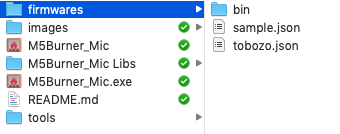
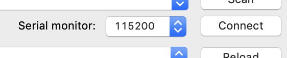
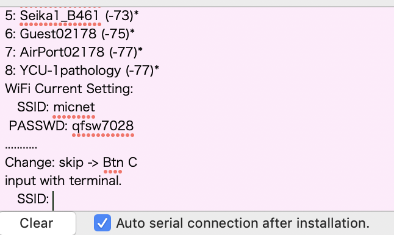
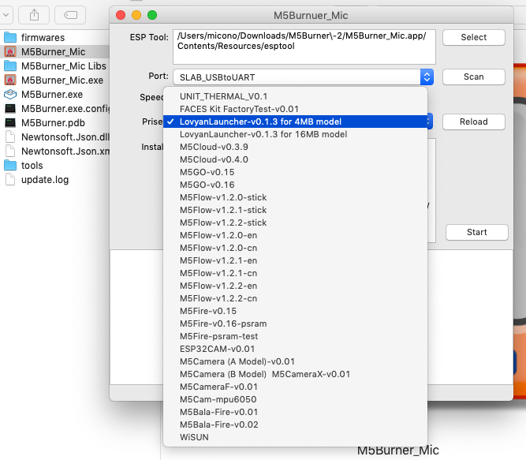

# M5Burner_Mic
[English](README.md)
### ダウンロードは [こちら(2019/9/26)](http://micutil.com/download/M5Burner_Mic.zip), マック版とウインドウズ版と両方入っています。
 

M5Burner by Micono 
(Mac and Windows version)

M5Burner_Micは、M5Stack・Odroid-GOなどESP32にファームやプログラムを転送するプログラムで、M5Burner（[https://m5stack.com/download](https://m5stack.com/download))と基本的に同じアプリケーションです。 M5Burner_Micアプリケーションと同じ階層にあるfirmwaresフォルダの中に設定ファイルが入っていればプログラムをロードして転送することができます。

## 更新
v1.3.2

- いくつかのファームにおいて、"4M Default"および"Fire Default"のPartition Schemeを追加した
- いくつかのファームを削除した

v1.3.1

- RoVoCoMo2とRSTesterを追加
- Odroid-GO firmwareのプリセットの不具合を修正

v1.3.0

- いくつかのファームを追加. (Odroid-GO firmware, UIFlow 1.3.2...)

v1.2.0

- Modified preset menu to be divided into each json file.
- どこにあるjsonファイルやそれらが入ったフォルダでも、ドラッグ＆ドロップすればプリセットに追加されます
- ビルドしたbinファイルをドラッグ＆ドロップすれば、設定ファイルがfirmwaresフォルダに構築されます

v1.1.0

- シンプルなシリアルモニター機能を追加しました。
- いくつかのM5Stack関連の公式ファームウェアをバンドルしました。
- SetWiFi_Micをバンドルしました

## バンドルされてるプログラム

(2019/9/13)

- UIFlow v1.2.3, v1.3.1beta, v1.3.2, v1.3.5beta, v1.4.0beta (M5Stack, M5Stick, M5StickC)
- Faces-Kit-v1.0.0
- M5Camera v1.0.0, QRScan-v1.0.0, Esp32Cam-Nopsram v1.0.1
- Odroid-GO firmware [v180728](https://wiki.odroid.com/odroid_go/firmware_update_oldfw), [v181001](https://wiki.odroid.com/odroid_go/firmware_update)
- [RoVoCoMo2](https://github.com/micutil/M5Stack_RoVoCoMo2), [RSTester](https://github.com/micutil/M5Stack_RSTester)

(2019/5/17)

- M5Stack related official firmwares (M5Bala, M5Cam, M5Cloud, M5Fire, M5Flow, M5GO, M5Unit, FACES_Kit)
- SD-Menu (M5Stack) ([tobozo/M5Stack-SD-Updater](https://github.com/tobozo/M5Stack-SD-Updater))
- SD-Menu (**Odroid-GO**):2019/5/17 ([tobozo/M5Stack-SD-Updater](https://github.com/tobozo/M5Stack-SD-Updater))
- SetWiFi_Mic (M5Stack):2019/5/17 ([micutil/SetWiFi_Mic](https://github.com/micutil/M5Burner_Mic))
- SetWiFi_Mic (**Odroid-GO**):2019/5/17 ([micutil/SetWiFi_Mic](https://github.com/micutil/M5Burner_Mic))
- Others: my sample program.

## 特徴

- M5BurnerのWindows版は、外部のfirmwaresとうフォルダの中にfirmwareが入っていますが、Mac版はパッケージの中に入っているので自作アプリでM5Burner対応にさせるのに面倒であるが、M5Burner_Micは、firmwaresフォルダの中のfirmwareを使うので、firmwaresをマック用とWin用と２つ用意する必要はありません
- M5BurnerのMac版では、ポートが選べないが、M5Burner_Micは選べます
- M5Burnerはパスにスペースが入ってたり、２バイト文字だったりすると、もしかするとうまく動かないかもしれないけど、M5Burner_Micはもしかすると動くかもしれません
- M5Burner_Micは、firmwaresフォルダの中に入っている拡張子が.jsonというファイルを読み込みますので、jsonファイルを個別に用意することもできます
- どこにあるjsonファイルやそれらが入ったフォルダでも、ドラッグ＆ドロップすればプリセットに追加されます
- ビルドしたbinファイルをドラッグ＆ドロップすれば、設定ファイルがfirmwaresフォルダに構築されます
- LovyanLauncherをインストールしたい場合は、[LovyanLauncher-firmware](https://github.com/lovyan03/LovyanLauncher-firmware)をダウンロード、解凍し、そのフォルダをM5Burner_Micの中のfiremwaresフォルダに入れて下さい。

## 使い方

基本的にM5Burnerと同じです

1. M5StackとコンピュータをUSBで繋ぎます
2. M5Burner_Micを起動し、ポートやボーレートを設定します
3. プリセットでファームウエアやプログラムを選択します
4. スタートボタンをクリックすると転送が始まります

- firmwaresフォルダの中にある拡張子がjsonのファイルをすべて読み込みます。jsonファイルを複数に分けて作っておくことが可能です）

**(シリアルモニターとして接続)**

1. シリアルモニターようの通信速度を設定
2. "Connect"ボタンをクリックする 

- シリアル接続されている場合、下部のフィールドの背景色がピンクに変わります。
- 接続を解除するには、「Disconnect」ボタンを押します。「Connect」ボタンだった場所のボタンです。

### tips
- 公式のM5BurnerのWindows版にM5Burner_Micを入れて使うこともできます。

## ライセンス

The M5Burner_Mic app itself is [CC BY 4.0](https://creativecommons.org/licenses/by/4.0/) Micono (https://github.com/micutil/M5Burner_Mic). You may distribute M5Burner_Mic as an installer for your program in your archive.

## 謝辞

tobozo           https://github.com/tobozo 
@o_sio (M5Stack) https://m5stack.com
